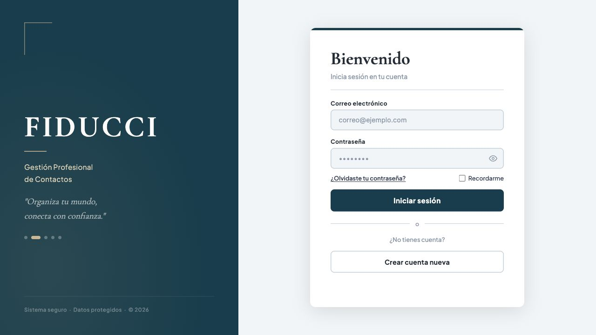
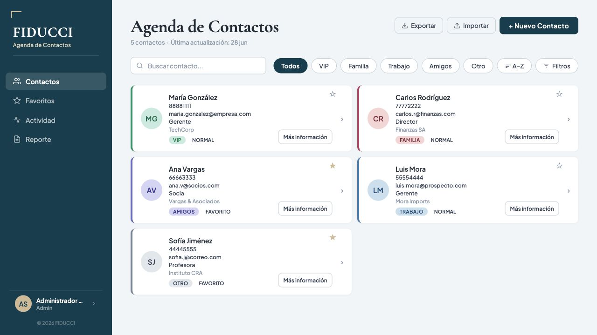

# FIDUCCI - Agenda de contactos

Proyecto del I Período de Programación Web desarrollado por **Damián Quirós**.

FIDUCCI es una aplicación web para administrar contactos. Permite iniciar sesión, registrar usuarios, crear, consultar, buscar, editar y eliminar contactos, gestionar favoritos, registrar interacciones y recordatorios, importar datos y consultar actividad y reportes. Los datos se almacenan en un libro de Excel incluido en el repositorio.

## Funcionalidades

- Inicio de sesión y registro de usuarios.
- Recuperación simulada de contraseña.
- Creación, consulta, edición y eliminación de contactos.
- Búsqueda, filtros y contactos favoritos.
- Registro de actividad, interacciones y recordatorios.
- Importación de contactos desde CSV o Excel.
- Exportación de contactos.
- Reporte general por categoría y estado de favorito.
- Edición del perfil de usuario.

## Tecnologías

- Python 3 y Flask.
- HTML5, CSS3 y JavaScript.
- openpyxl y Microsoft Excel como almacenamiento local.
- Flask-Cors y Werkzeug.

## Estructura del repositorio

```text
Proyecto-I-Periodo-DamianQuiros/
├── app.py                 # Servidor Flask y API
├── contactos.xlsx         # Datos iniciales de la aplicación
├── requirements.txt       # Dependencias de Python
├── static/
│   ├── css/               # Estilos de cada pantalla
│   └── JavaScript/        # Lógica del cliente
├── templates/             # Vistas HTML
├── tests/                 # Pruebas automatizadas
└── docs/capturas/         # Evidencia visual
```

## Instalación

Requisitos: Python 3.10 o superior y Git.

```bash
git clone https://github.com/damianquiros-developer/Proyecto-I-Periodo-DamianQuiros.git
cd Proyecto-I-Periodo-DamianQuiros
python3 -m venv .venv
source .venv/bin/activate
python3 -m pip install -r requirements.txt
python3 app.py
```

En Windows, active el entorno con `.venv\Scripts\activate`.

Abra [http://localhost:5000](http://localhost:5000) en el navegador.

## Acceso de demostración

- Usuario: `admin`
- Contraseña: `1234`

Estas credenciales son únicamente para la demostración académica local.

## Pruebas

Desde la raíz del proyecto y con las dependencias instaladas:

```bash
python3 -m unittest discover -s tests -v
```

Las pruebas trabajan con una copia temporal de `contactos.xlsx`; no modifican los datos entregados.

## Evidencia visual

### Inicio de sesión



### Panel principal



## Datos

`contactos.xlsx` contiene las hojas necesarias para usuarios, contactos, metadatos, actividad y recordatorios. Si el archivo no existe, la aplicación crea una base inicial automáticamente.

## Autor

**Damián Quirós** - Sección 11-5, Programación Web, 2026.

